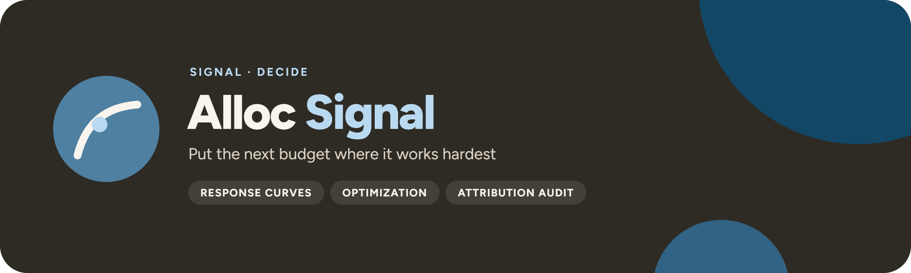

<p align="center">
  
</p>

<p align="center">
  <a href="https://github.com/UlrikErlingsen/marketing-mix-allocation/actions"></a>
  <a href="https://github.com/UlrikErlingsen/signal-hub"></a>
  
  
  <a href="LICENSE"></a>
</p>

<p align="center"><strong>Open marketing-response planning — diminishing-return curves and real constraints in, an auditable budget recommendation out.</strong></p>

**Alloc Signal** helps a marketer decide how much to spend and how to divide a budget across channels. It draws saturating response curves, compares the current plan with optimized alternatives, reports marginal return and elasticity, and stress-tests the recommendation. Separate workspaces compare panel models and audit digital campaign economics, tracking coverage, search-keyword assumptions, and retrospective attribution.

> Where should the next marketing budget go?

The interface starts with the decision. The methods, assumptions, and diagnostics remain close enough for an analyst to audit. Everything runs locally with open-source Python packages; there is no account, telemetry, external AI call, remote database, or built-in persistence.

## Read this first

> **An optimizer makes assumptions consistent; it does not make them true.** A numerically preferred allocation can still be strategically wrong when response curves are weakly calibrated, spend has little historical variation, channels interact, execution cannot move that quickly, or an estimated association is mistaken for causality.

Alloc Signal therefore separates two jobs:

1. **Planning:** encode a defensible diminishing-return story for each channel, add business constraints, and compare allocations.
2. **Evidence checking:** use repeated unit-by-time observations to ask whether within-unit changes support the assumed direction and size of marketing effects.

A panel coefficient is not silently converted into a causal response curve. Connecting evidence to planning remains an explicit analyst judgment.

## Scope

**Version 1.2 supports:**

- **Current plan:** spend, modeled response, contribution, elasticity, and marginal contribution by channel.
- **Budget reallocation:** a fixed-total-budget recommendation respecting channel minima, maxima, and fixed commitments.
- **Budget sizing:** a profit-oriented scenario when total spend may change within declared bounds.
- **Diminishing returns:** response curves and their analytic slopes, not constant average ROI extrapolation.
- **Economic logic:** at an unconstrained interior optimum, marginal response × margin approaches the marginal cost of spend; constraints can prevent equality.
- **Short and long run:** an explicitly labeled multiplier for delayed outcomes, not an unidentified dynamic model.
- **Sensitivity:** low/base/high cases showing whether the decision survives plausible parameter changes.
- **Panel structure:** pooled, fixed-effects, and random-effects estimates, uncertainty, within variation, and Hausman comparison.
- **Digital economics:** CPM, CPC, CTR, CVR, CPA, contribution ROAS, break-even CPC/CPA, keyword-level economics, and tracking coverage.
- **Attribution audit:** declared windows, identity coverage, view-through/cross-device assumptions, and an explicit non-causal retrospective label.
- **Schedule & carryover:** per-period plan arithmetic with declared geometric adstock (retention λ and its half-life), declared-parameter reach/frequency, bounded pairwise interaction scenarios, and CSV export of every schedule table.
- **Decision evidence:** portable tables and an audit trail containing inputs, assumptions, constraints, diagnostics, and warnings.

**It does not** claim more than those inputs support:

- Response-curve inputs are not causal merely because they are precise.
- Historical regression association is not incremental lift without a defensible identification design.
- Retrospective attribution assigns observed credit under declared rules; it does not identify incremental lift and never triggers automatic reallocation.
- Average ROI is not the return to the next currency unit; marginal return drives allocation.
- Deterministic pairwise searches and multi-start SLSQP reduce local-solution risk but do not prove the joint global optimum when more than two channels can move.
- An optimized plan is not implementable until minimum commitments, capacity, contracts, learning periods, and organizational constraints are represented.
- Independent channel curves do not capture synergy, substitution, shared reach, auction feedback, competitor response, or a changing market baseline.
- The long-run multiplier is a scenario device, not evidence of carryover. Use lagged or adstock models only when timing, variation, and assumptions support them.
- The schedule workspace computes with declared retention, audience, cost, and interaction parameters; none of those numbers are estimated from data, and its interaction multipliers are scenario arithmetic, not measured synergy.

Where a sibling app covers it, use **[Experiment Signal](https://github.com/UlrikErlingsen/experiment-analysis)** for randomized incremental lift, **[Worth Signal](https://github.com/UlrikErlingsen/customer-value-analytics)** for customer-value economics, and **[Trace Signal](https://github.com/UlrikErlingsen/journey-path-analysis)** for describing logged customer journeys.

## Try the demo in three minutes

The fictional demo is preloaded: the app opens with a synthetic six-channel plan, a 12-region panel, and a digital campaign already loaded, so every page works before you upload anything. The sidebar **Demo · channel plan** and **Demo · regional panel** buttons restore a demo (and jump to its page); an upload replaces it.

1. Start the app and open **1 · Curves & assumptions**; the fictional channel plan is already validated and plotted.
2. Review current, minimum, maximum, fixed-channel, saturation, half-saturation, and curve-shape assumptions.
3. Compare the current plan with an optimized fixed-budget allocation. Read the change in contribution and each channel's marginal contribution from one more currency unit.
4. Open the response curves and sensitivity view. Notice which recommendation changes when ceiling response or half-saturation is less favorable.
5. Open **3 · Panel evidence** (the fictional regional panel is already loaded). Select `region` as the entity, `period` as time, and `sales` as the outcome; compare pooled OLS, fixed effects, and random effects.
6. Open **Digital economics & attribution**, where the fictional campaign is already loaded, to calculate CPM/CPC/CTR/CVR/CPA and contribution economics, then review tracking and attribution warnings.
7. Export the tables, assumptions, warnings, and model evidence needed to reproduce the discussion, as XLSX, CSV-ZIP, or JSON.

The demos are fictional, synthetic teaching data. They describe no real company, campaign, channel, or market.

## Data contract

Alloc Signal accepts two separate table types. CSV, Excel, and JSON are supported; uploads are capped at 200 MB by default (`ALLOCSIGNAL_MAX_UPLOAD_MB`, at most 500), JSON at 30 MB, and tables at 500,000 rows.

### Planning data

Use one row per channel.

| channel | current_spend | min_spend | max_spend | floor_response | ceiling_response | half_saturation | shape | long_run_multiplier | fixed |
|---|---:|---:|---:|---:|---:|---:|---:|---:|---|
| Paid search | 120000 | 50000 | 220000 | 0 | 760000 | 115000 | 1.35 | 1.08 | false |
| Retail media | 90000 | 30000 | 180000 | 0 | 520000 | 95000 | 1.20 | 1.04 | false |

Monetary fields must use one consistent currency and time period. Response must be an economically meaningful quantity such as incremental sales revenue, units, or gross profit opportunity.

### Panel-evidence data

Use one row per entity-period pair. An entity can be a region, store, account, product, or another stable unit observed repeatedly.

| region | period | sales | paid_search | online_display | distribution | price_index |
|---|---|---:|---:|---:|---:|---:|
| North | 2025-Q1 | 831000 | 94000 | 56000 | 0.76 | 1.03 |
| North | 2025-Q2 | 865000 | 101000 | 59000 | 0.78 | 1.02 |
| South | 2025-Q1 | 692000 | 72000 | 43000 | 0.67 | 0.98 |

Every selected entity-period pair must be unique. A credible panel needs repeated observations, within-entity variation in the predictors, and enough entities for uncertainty estimates.

See the [data guide](docs/data_guide.md) for units, anchors, constraints, validation, historical variation, and templates.

## Analysis contract

Before a budget run, the app records the economics and rules the recommendation depends on: the contribution margin per response unit, the response not assigned to channels, the effect horizon, the chosen total budget, every channel minimum, maximum and fixed commitment, and the sensitivity width. These settings travel with every allocation result and export, so a reader can see which assumptions produced the plan. Panel runs record the entity, time and outcome roles, the predictors, time fixed effects, and the uncertainty choice in the same way.

## Methods

Alloc Signal applies one contribution margin to translate response into contribution:

`contribution(spend) = response(spend) × contribution margin − spend`

The built-in curve is the ADBUDG/Hill form:

`response(x) = b + (a − b) × x^c / (d + x^c)`

where `b` is the floor, `a` is the saturation ceiling, `c` controls shape, and `d = half_saturation^c`. At the half-saturation spend, the curve is halfway from its floor to its ceiling. This parameterization makes the scale easier to discuss than an opaque `d` value.

For fixed-budget allocation, Alloc Signal retains the best known feasible starting plan, creates additional deterministic starts through dense global searches along two-channel budget exchanges, and then runs multi-start SLSQP. With exactly two movable channels, the pairwise search covers the complete feasible budget line. With more channels, repeated pairwise searches plus SLSQP are a stronger globalisation heuristic—not a universal guarantee of the joint global optimum. Always inspect binding bounds, solver notes, and sensitivity rather than treating `success` as proof of global optimality.

Pooled OLS mixes within- and between-entity relationships. Fixed effects use deviations from each entity's own mean. Random effects add a stronger assumption: persistent unit differences must be uncorrelated with the included predictors.

Alloc Signal's Hausman comparison is an assumption diagnostic, not a truth machine. Displayed FE and RE intervals may use entity-clustered or HC1-robust uncertainty, while the classical Hausman statistic is calculated from separate conventional model-based FE and RE covariance refits. The covariance basis is labeled with the result. If the models have no common estimable substantive slope, or the covariance difference has rank zero, the statistic and p-value are suppressed and the result is marked invalid. A small valid p-value is evidence against the random-effects orthogonality assumption under the test's conditions; a large valid p-value does not prove that assumption or establish causality.

A disciplined workflow:

1. Write the decision, planning horizon, currency, outcome unit, and contribution margin before tuning curves.
2. Calibrate each curve from experiments, quasi-experiments, historical evidence, or clearly labeled judgmental anchors.
3. Inspect historical spend range. An observed narrow range cannot identify a distant saturation point.
4. Declare minima, maxima, fixed commitments, and total-budget rules.
5. Run current, unconstrained, and constrained cases; explain which constraints bind.
6. Stress-test curve ceiling, half-saturation, margin, and delayed response.
7. Translate the result into an implementable change, preferably with holdouts or staged tests.
8. Monitor realized spend, reach, response, contribution, and model error; recalibrate rather than treating the first optimum as permanent.

See [methods](docs/methods.md).

## Decision statuses

Alloc Signal does not issue a go/no-go verdict; the allocation is a scenario conditional on the curves, margin, independence, horizon, and constraints. The labels it does return:

- **POSITIVE OBSERVED CONTRIBUTION / OBSERVED BREAK-EVEN / NEGATIVE OBSERVED CONTRIBUTION**: each digital campaign or keyword row, from observed conversions × margin minus spend.
- **DESCRIPTIVE ONLY**: the attribution audit's incrementality status unless the method is declared calibrated against randomized lift evidence (**CALIBRATED, NOT PROVEN**).
- **NO AUTOMATIC REALLOCATION**: always attached to retrospective attribution; attributed credit never moves budget.
- **Hausman valid / invalid**: the conventional interpretation is suppressed when no common slope is estimable or the covariance difference has rank zero.
- **Feasible (recomputed)**: every budget run is re-checked against the chosen total, channel bounds, and fixed commitments in the solver diagnostics.

See the [decision guide](docs/decision_guide.md).

## Exports

Excel, CSV-ZIP and JSON exports include:

- the planning and panel source filenames and SHA-256 fingerprints;
- the software version, Python, pandas, Streamlit, and statsmodels versions;
- the allocation decision summary, run summaries, assumptions, solver diagnostics, channel assumptions, baseline, constrained, profit-sized, and sensitivity allocations, and any anchor calibrations;
- panel structure, assumptions, model comparison and metrics, coefficients, within/between slopes, variation, VIF, fitted values and residuals, and the Hausman test with its covariance basis;
- the independence assumption, causal status, warnings, and notes.

The digital workspace and the schedule page have their own evidence and CSV downloads. Exports are created only when requested and source files are never modified. Exported text is neutralised against spreadsheet-formula interpretation.

## Run locally

You need Python 3.10 or newer and a local copy of this folder.

**macOS:** double-click `run_app.command`. **Windows:** double-click `run_app.bat`.

The first launch creates a private `.venv` and downloads open-source dependencies. Later launches reuse it. Or use a terminal:

```bash
python3 -m venv .venv
source .venv/bin/activate  # Windows: .venv\Scripts\activate
python -m pip install -r requirements.txt
python -m streamlit run app.py
```

The launchers prefer local port 8593 and accept `ALLOCSIGNAL_PORT`, `ALLOCSIGNAL_MAX_UPLOAD_MB`, `ALLOCSIGNAL_NO_BROWSER` and `ALLOCSIGNAL_DEBUG`.

### Docker

```bash
docker build -t allocsignal .
docker run --rm -p 8593:8593 allocsignal
```

Then open http://127.0.0.1:8593. The container runs the app as a non-root user. This repository does not promise a hosted public instance.

## Privacy

Local mode reads uploads into the Python process on that computer. Alloc Signal adds no accounts, advertising, telemetry, external AI calls, or built-in data storage.

Panel data can still be confidential or personal when an entity identifies a person, small account, or location. Use pseudonymous keys, aggregate where possible, and remove names, emails, free text, customer identifiers, and unnecessary columns. A hosted deployment changes the trust boundary; read [PRIVACY.md](PRIVACY.md) and [SECURITY.md](SECURITY.md).

## No install? Give this file to an AI

Don't want to install anything? [AI_ANALYST.md](AI_ANALYST.md) is a single copy-paste file that turns a capable AI assistant (Claude, ChatGPT, Gemini, …) into this analysis. Copy the file into a chat, add your data, and the AI follows the same published methods and honesty rules as the app. The app is still the more private option: local mode keeps your data on your computer, while a cloud AI sees whatever you paste.

## Development

```bash
python -m pip install -e ".[test]"
python -m pytest
python -m ruff check .
python -m build
```

Statistical changes should be checked against analytically derived values or independently generated synthetic data. Optimization tests must verify feasibility as well as objective improvement. The suite also checks the Signal Hub contract: `allocsignal.ui.render()` draws the app without a page config, only `allocsignal.ui` imports Streamlit or Plotly, and every state and widget key is namespaced. See [CONTRIBUTING.md](CONTRIBUTING.md).

## Where this fits in Signal

Alloc Signal turns unit economics and evidence into a budget scenario. Worth Signal can supply better unit economics, and Experiment Signal can test the shift before it is scaled. Alloc Signal uses a contribution margin, but it is not a customer-lifetime-value model; Worth Signal supplies the value side, and Alloc Signal then applies it to a channel-allocation decision. Recommend Signal's offline accuracy metrics are not causal return inputs here, and Trace Signal's Markov removal sensitivity is descriptive, not causal channel credit for allocation.

<!-- signal-suite:start (generated from signal-hub/apps.yaml by scripts/sync_readme_suite.py) -->
| Family | App | Asks |
|---|---|---|
| Brand | [Track Signal](https://github.com/UlrikErlingsen/brand-tracking) | Is the brand moving, or is the tracker just noisy? |
| Brand | [Position Signal](https://github.com/UlrikErlingsen/brand-positioning) | Where do brands sit relative to competitors? |
| Market | [Prospect Signal](https://github.com/UlrikErlingsen/b2b-prospecting) | Which Norwegian companies fit your ideal customer, and which first? |
| Market | [Listen Signal](https://github.com/UlrikErlingsen/media-listening) | Who is talking about the brand in Norwegian media, and in what tone? |
| Market | [Influence Signal](https://github.com/UlrikErlingsen/influencer-campaigns) | Which creators delivered, and was every post labelled properly? |
| Market | [Season Signal](https://github.com/UlrikErlingsen/marketing-calendar) | What does the Norwegian marketing year look like, worked backwards? |
| Market | [Adopt Signal](https://github.com/UlrikErlingsen/adoption-forecasting) | When will a new product be adopted? |
| Customer | [Worth Signal](https://github.com/UlrikErlingsen/customer-value-analytics) | What are customers and relationships worth? |
| Customer | [Segment Signal](https://github.com/UlrikErlingsen/customer-segmentation) | Do customers form stable, useful groups? |
| Customer | [Trace Signal](https://github.com/UlrikErlingsen/journey-path-analysis) | How do logged customer journeys actually unfold? |
| Customer | [Recommend Signal](https://github.com/UlrikErlingsen/recommender-evaluation) | Which recommendation policy should be tested live? |
| Research | [Choice Signal](https://github.com/UlrikErlingsen/conjoint-analysis) | How do product attributes drive choice? |
| Research | [Driver Signal](https://github.com/UlrikErlingsen/survey-driver-analysis) | Which measured experiences move with satisfaction? |
| Research | [Measure Signal](https://github.com/UlrikErlingsen/measurement-validation) | Does a multi-item score have a defensible structure? |
| Research | [Text Signal](https://github.com/UlrikErlingsen/open-text-analysis) | What recurring patterns appear in open-ended responses? |
| Research | [Tag Signal](https://github.com/UlrikErlingsen/pricing-analysis) | What price range is supported, and how does profit move? |
| Decide | [Experiment Signal](https://github.com/UlrikErlingsen/experiment-analysis) | Did the treatment cause a practically meaningful change? |
| Decide | [Gate Signal](https://github.com/UlrikErlingsen/launch-decision-gate) | Does a concept deserve the next investment? |
| Decide | [Shift Signal](https://github.com/UlrikErlingsen/cannibalization-analysis) | Does a launch grow the portfolio, or move existing demand around? |
| Decide | **Alloc Signal** (this app) | Where should the next marketing budget go? |

All 20 apps run side by side in [Signal Hub](https://github.com/UlrikErlingsen/signal-hub), each opening with fictional demo data. Every repo carries the [`signal-suite`](https://github.com/topics/signal-suite) topic, and the suite is listed at [ulrikerlingsen.com](https://ulrikerlingsen.com). Freddo CRM is a separate product.
<!-- signal-suite:end -->

## References

- Little, J. D. C. (1970). Models and managers: The concept of a decision calculus. *Management Science, 16*(8), B-466–B-485. [https://doi.org/10.1287/mnsc.16.8.B466](https://doi.org/10.1287/mnsc.16.8.B466)
- Hanssens, D. M., Parsons, L. J., & Schultz, R. L. (2001). *Market Response Models: Econometric and Time Series Analysis* (2nd ed.). Kluwer Academic Publishers.
- Wooldridge, J. M. (2010). *Econometric Analysis of Cross Section and Panel Data* (2nd ed.). MIT Press.
- Hausman, J. A. (1978). Specification tests in econometrics. *Econometrica, 46*(6), 1251–1271. [https://doi.org/10.2307/1913827](https://doi.org/10.2307/1913827)
- Broadbent, S. (1979). One way TV advertisements work. *Journal of the Market Research Society, 21*(3), 139–166. (Geometric adstock on the schedule page.)
- Rust, R. T. (1986). *Advertising Media Models: A Practical Guide*. Lexington Books. (Declared-parameter reach and frequency on the schedule page.)

If Alloc Signal supports research or teaching, cite the software metadata in [CITATION.cff](CITATION.cff) and the primary source appropriate to the selected method.

## Originality and license

Alloc Signal is an independent implementation based on public statistical and marketing-science literature and original synthetic examples.

Alloc Signal is free software under **AGPL-3.0-or-later**. Commercial use is allowed; distribution and modified network services carry the source-sharing obligations in [LICENSE](LICENSE). The license covers this project's code and documentation, not ownership of the published methods it implements.

This application was developed with AI coding assistance and checked through source review and automated tests. Verify material decisions independently; no warranty is provided.

---

<p>
  
  <strong>Alloc Signal</strong> is part of <a href="https://github.com/UlrikErlingsen/signal-hub"><strong>Signal</strong></a>, open marketing-evidence tools by <a href="https://ulrikerlingsen.com">Ulrik Erlingsen</a>.
</p>
